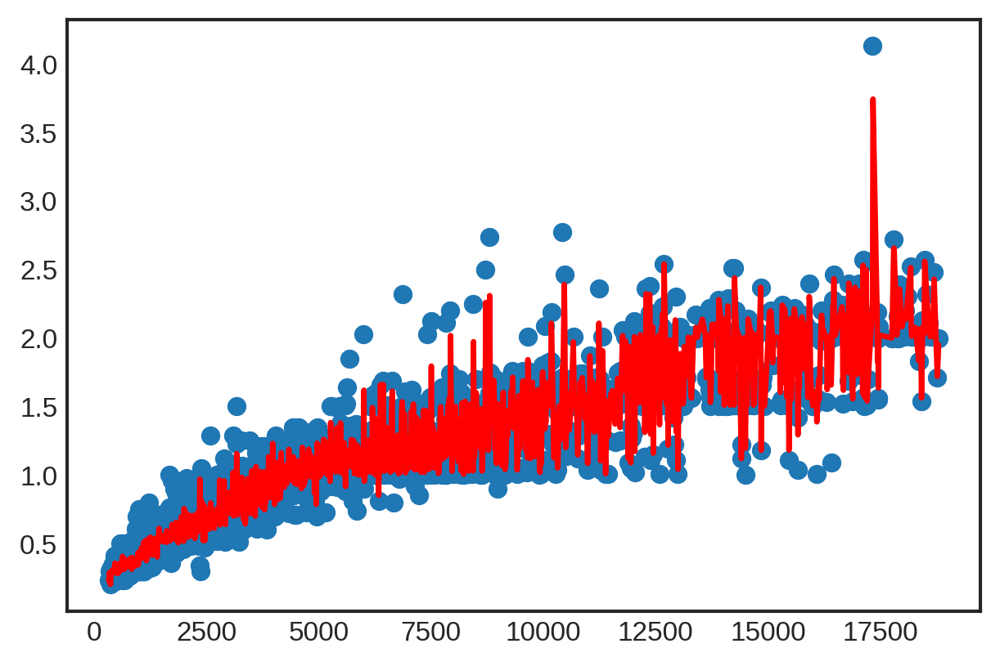

# Introduction to Locally Weighted Regression 

---

Before we get to locally weighted regression we will start with the basic assumption of linear regresion: $$ y = X ⋅ β + σϵ$$

Linear regrssion is the linear combination of observed outputs i.e. values of the dependent variable. Below we have the vectorized form of linear regression where $X^T$ are our observations:

$$ X^T y = X^T β + σX^Tϵ$$

We can solve for $β$ using the assumtion that $X^TX$ is an invertivle matrix.

$$β = (X^TX)^{-1} (X^Ty)-σ(X^TX)^{-1} X^T ϵ$$ 

Using this form we can take the expected value $\bar{β}$:

$$\bar{β} = (X^T)^{-1}(X^Ty)$$

Then the formula for predictions:

$$\hat{y} = X(X^TX)^{-1}(X^Ty)$$

For locally weighted regression we can multiply the equation for $\hat{y}$ with the diagonalized matrix of weights where the $i^{th}$ observation weight is on the diagonal.

$$diag(W(i))y = diag(W(i))X \cdot β + σ(W(i))ϵ$$

The equation is resolved to:

$$ diag(W(i))y = diag(W(i))X ⋅ \hat{β}$$

Each independent observation is a row in the matrix $X$. Each row has features (columns) $p$ such that every row is a vector in $\mathbb{R}^p$. For every $n$ observations we have $n$ weight vectors.

For locally weighted regression we have the formula:

$$\hat{y} = X(X^TWX)^{-1}(X^TWy)$$

The main takeaway is the predictions are the linear combination of the actual observed values of the dependent variable. In locally weighted regression, $\hat{y}$ is derived from different linear combinations of $y$. 

---

# Let's explore these formulas with an example

Start by importing the nessessary packages and supporting configurations


```python
%matplotlib inline
%config InlineBackend.figure_format = 'retina'
import matplotlib.pyplot as plt
import matplotlib as mpl
mpl.rcParams['figure.dpi'] = 120
```


```python
import numpy as np
import pandas as pd
from math import ceil
from scipy import linalg
from scipy.interpolate import interp1d

from IPython.display import Image
from IPython.display import display
plt.style.use('seaborn-white')
```

For the example we will be using a dataset that describes different diamonds. The dataset will be limited to 5000 (of approx. 53000) samples to allow for faster processing times.


```python
# Load the data and sample 5000 examples
# Cut the first idex column out
data = pd.read_csv("/content/drive/MyDrive/Data Science/Data 441/LOWESS/diamonds.csv").iloc[:,1:].sample(5000)
data
```


  <div id="df-1b06154c-b333-4457-a94d-3198c628553b">
    <div class="colab-df-container">
      <div>
<style scoped>
    .dataframe tbody tr th:only-of-type {
        vertical-align: middle;
    }

    .dataframe tbody tr th {
        vertical-align: top;
    }

    .dataframe thead th {
        text-align: right;
    }
</style>
<table border="1" class="dataframe">
  <thead>
    <tr style="text-align: right;">
      <th></th>
      <th>carat</th>
      <th>cut</th>
      <th>color</th>
      <th>clarity</th>
      <th>depth</th>
      <th>table</th>
      <th>price</th>
      <th>x</th>
      <th>y</th>
      <th>z</th>
    </tr>
  </thead>
  <tbody>
    <tr>
      <th>6841</th>
      <td>1.13</td>
      <td>Fair</td>
      <td>J</td>
      <td>SI1</td>
      <td>64.9</td>
      <td>55.0</td>
      <td>4123</td>
      <td>6.49</td>
      <td>6.56</td>
      <td>4.24</td>
    </tr>
    <tr>
      <th>18148</th>
      <td>1.01</td>
      <td>Premium</td>
      <td>F</td>
      <td>VS1</td>
      <td>59.4</td>
      <td>60.0</td>
      <td>7353</td>
      <td>6.50</td>
      <td>6.46</td>
      <td>3.85</td>
    </tr>
    <tr>
      <th>15457</th>
      <td>1.00</td>
      <td>Good</td>
      <td>D</td>
      <td>VS2</td>
      <td>62.8</td>
      <td>61.0</td>
      <td>6189</td>
      <td>6.31</td>
      <td>6.34</td>
      <td>3.97</td>
    </tr>
    <tr>
      <th>18415</th>
      <td>1.02</td>
      <td>Premium</td>
      <td>F</td>
      <td>VS1</td>
      <td>61.9</td>
      <td>58.0</td>
      <td>7485</td>
      <td>6.50</td>
      <td>6.45</td>
      <td>4.01</td>
    </tr>
    <tr>
      <th>40242</th>
      <td>0.37</td>
      <td>Ideal</td>
      <td>E</td>
      <td>VS1</td>
      <td>61.2</td>
      <td>56.0</td>
      <td>1124</td>
      <td>4.67</td>
      <td>4.64</td>
      <td>2.85</td>
    </tr>
    <tr>
      <th>...</th>
      <td>...</td>
      <td>...</td>
      <td>...</td>
      <td>...</td>
      <td>...</td>
      <td>...</td>
      <td>...</td>
      <td>...</td>
      <td>...</td>
      <td>...</td>
    </tr>
    <tr>
      <th>48616</th>
      <td>0.54</td>
      <td>Ideal</td>
      <td>G</td>
      <td>SI1</td>
      <td>60.0</td>
      <td>57.0</td>
      <td>1999</td>
      <td>5.31</td>
      <td>5.36</td>
      <td>3.20</td>
    </tr>
    <tr>
      <th>45373</th>
      <td>0.58</td>
      <td>Ideal</td>
      <td>F</td>
      <td>VS2</td>
      <td>62.1</td>
      <td>55.0</td>
      <td>1666</td>
      <td>5.33</td>
      <td>5.37</td>
      <td>3.32</td>
    </tr>
    <tr>
      <th>34675</th>
      <td>0.41</td>
      <td>Good</td>
      <td>D</td>
      <td>VS2</td>
      <td>63.4</td>
      <td>54.0</td>
      <td>873</td>
      <td>4.74</td>
      <td>4.79</td>
      <td>3.02</td>
    </tr>
    <tr>
      <th>50682</th>
      <td>0.76</td>
      <td>Ideal</td>
      <td>H</td>
      <td>SI2</td>
      <td>63.0</td>
      <td>56.0</td>
      <td>2288</td>
      <td>5.81</td>
      <td>5.84</td>
      <td>3.67</td>
    </tr>
    <tr>
      <th>25633</th>
      <td>1.51</td>
      <td>Premium</td>
      <td>G</td>
      <td>VS1</td>
      <td>60.1</td>
      <td>58.0</td>
      <td>14507</td>
      <td>7.48</td>
      <td>7.45</td>
      <td>4.49</td>
    </tr>
  </tbody>
</table>
<p>5000 rows × 10 columns</p>
</div>
      <button class="colab-df-convert" onclick="convertToInteractive('df-1b06154c-b333-4457-a94d-3198c628553b')"
              title="Convert this dataframe to an interactive table."
              style="display:none;">

  <svg xmlns="http://www.w3.org/2000/svg" height="24px"viewBox="0 0 24 24"
       width="24px">
    <path d="M0 0h24v24H0V0z" fill="none"/>
    <path d="M18.56 5.44l.94 2.06.94-2.06 2.06-.94-2.06-.94-.94-2.06-.94 2.06-2.06.94zm-11 1L8.5 8.5l.94-2.06 2.06-.94-2.06-.94L8.5 2.5l-.94 2.06-2.06.94zm10 10l.94 2.06.94-2.06 2.06-.94-2.06-.94-.94-2.06-.94 2.06-2.06.94z"/><path d="M17.41 7.96l-1.37-1.37c-.4-.4-.92-.59-1.43-.59-.52 0-1.04.2-1.43.59L10.3 9.45l-7.72 7.72c-.78.78-.78 2.05 0 2.83L4 21.41c.39.39.9.59 1.41.59.51 0 1.02-.2 1.41-.59l7.78-7.78 2.81-2.81c.8-.78.8-2.07 0-2.86zM5.41 20L4 18.59l7.72-7.72 1.47 1.35L5.41 20z"/>
  </svg>
      </button>

  <style>
    .colab-df-container {
      display:flex;
      flex-wrap:wrap;
      gap: 12px;
    }

    .colab-df-convert {
      background-color: #E8F0FE;
      border: none;
      border-radius: 50%;
      cursor: pointer;
      display: none;
      fill: #1967D2;
      height: 32px;
      padding: 0 0 0 0;
      width: 32px;
    }

    .colab-df-convert:hover {
      background-color: #E2EBFA;
      box-shadow: 0px 1px 2px rgba(60, 64, 67, 0.3), 0px 1px 3px 1px rgba(60, 64, 67, 0.15);
      fill: #174EA6;
    }

    [theme=dark] .colab-df-convert {
      background-color: #3B4455;
      fill: #D2E3FC;
    }

    [theme=dark] .colab-df-convert:hover {
      background-color: #434B5C;
      box-shadow: 0px 1px 3px 1px rgba(0, 0, 0, 0.15);
      filter: drop-shadow(0px 1px 2px rgba(0, 0, 0, 0.3));
      fill: #FFFFFF;
    }
  </style>

      <script>
        const buttonEl =
          document.querySelector('#df-1b06154c-b333-4457-a94d-3198c628553b button.colab-df-convert');
        buttonEl.style.display =
          google.colab.kernel.accessAllowed ? 'block' : 'none';

        async function convertToInteractive(key) {
          const element = document.querySelector('#df-1b06154c-b333-4457-a94d-3198c628553b');
          const dataTable =
            await google.colab.kernel.invokeFunction('convertToInteractive',
                                                     [key], {});
          if (!dataTable) return;

          const docLinkHtml = 'Like what you see? Visit the ' +
            '<a target="_blank" href=https://colab.research.google.com/notebooks/data_table.ipynb>data table notebook</a>'
            + ' to learn more about interactive tables.';
          element.innerHTML = '';
          dataTable['output_type'] = 'display_data';
          await google.colab.output.renderOutput(dataTable, element);
          const docLink = document.createElement('div');
          docLink.innerHTML = docLinkHtml;
          element.appendChild(docLink);
        }
      </script>
    </div>
  </div>


Visualize the data


```python
X, y = data['price'].values, data['carat'].values
plt.scatter(X,y)
```


    <matplotlib.collections.PathCollection at 0x7fde7414d5e0>


    

    


```python
data.sort_values(by='carat')
```


  <div id="df-963e9f7d-d99b-46ac-a3bc-7cefa97c22c6">
    <div class="colab-df-container">
      <div>
<style scoped>
    .dataframe tbody tr th:only-of-type {
        vertical-align: middle;
    }

    .dataframe tbody tr th {
        vertical-align: top;
    }

    .dataframe thead th {
        text-align: right;
    }
</style>
<table border="1" class="dataframe">
  <thead>
    <tr style="text-align: right;">
      <th></th>
      <th>carat</th>
      <th>cut</th>
      <th>color</th>
      <th>clarity</th>
      <th>depth</th>
      <th>table</th>
      <th>price</th>
      <th>x</th>
      <th>y</th>
      <th>z</th>
    </tr>
  </thead>
  <tbody>
    <tr>
      <th>31599</th>
      <td>0.20</td>
      <td>Ideal</td>
      <td>E</td>
      <td>VS2</td>
      <td>62.2</td>
      <td>57.0</td>
      <td>367</td>
      <td>3.76</td>
      <td>3.73</td>
      <td>2.33</td>
    </tr>
    <tr>
      <th>47325</th>
      <td>0.23</td>
      <td>Very Good</td>
      <td>D</td>
      <td>VVS2</td>
      <td>62.6</td>
      <td>58.0</td>
      <td>530</td>
      <td>3.89</td>
      <td>3.94</td>
      <td>2.45</td>
    </tr>
    <tr>
      <th>40938</th>
      <td>0.23</td>
      <td>Very Good</td>
      <td>D</td>
      <td>VVS2</td>
      <td>59.6</td>
      <td>61.0</td>
      <td>499</td>
      <td>3.99</td>
      <td>4.03</td>
      <td>2.39</td>
    </tr>
    <tr>
      <th>42288</th>
      <td>0.23</td>
      <td>Good</td>
      <td>E</td>
      <td>VVS2</td>
      <td>62.2</td>
      <td>60.0</td>
      <td>505</td>
      <td>3.90</td>
      <td>3.94</td>
      <td>2.44</td>
    </tr>
    <tr>
      <th>43909</th>
      <td>0.23</td>
      <td>Ideal</td>
      <td>H</td>
      <td>VS2</td>
      <td>62.3</td>
      <td>53.0</td>
      <td>512</td>
      <td>3.96</td>
      <td>3.99</td>
      <td>2.48</td>
    </tr>
    <tr>
      <th>...</th>
      <td>...</td>
      <td>...</td>
      <td>...</td>
      <td>...</td>
      <td>...</td>
      <td>...</td>
      <td>...</td>
      <td>...</td>
      <td>...</td>
      <td>...</td>
    </tr>
    <tr>
      <th>27612</th>
      <td>2.57</td>
      <td>Premium</td>
      <td>J</td>
      <td>SI1</td>
      <td>63.0</td>
      <td>58.0</td>
      <td>18485</td>
      <td>8.77</td>
      <td>8.65</td>
      <td>5.49</td>
    </tr>
    <tr>
      <th>27302</th>
      <td>2.72</td>
      <td>Ideal</td>
      <td>J</td>
      <td>SI2</td>
      <td>62.1</td>
      <td>56.0</td>
      <td>17801</td>
      <td>8.97</td>
      <td>8.93</td>
      <td>5.56</td>
    </tr>
    <tr>
      <th>20462</th>
      <td>2.74</td>
      <td>Fair</td>
      <td>J</td>
      <td>I1</td>
      <td>64.9</td>
      <td>61.0</td>
      <td>8807</td>
      <td>8.76</td>
      <td>8.66</td>
      <td>5.65</td>
    </tr>
    <tr>
      <th>22399</th>
      <td>2.77</td>
      <td>Premium</td>
      <td>H</td>
      <td>I1</td>
      <td>62.6</td>
      <td>62.0</td>
      <td>10424</td>
      <td>8.93</td>
      <td>8.83</td>
      <td>5.56</td>
    </tr>
    <tr>
      <th>27130</th>
      <td>4.13</td>
      <td>Fair</td>
      <td>H</td>
      <td>I1</td>
      <td>64.8</td>
      <td>61.0</td>
      <td>17329</td>
      <td>10.00</td>
      <td>9.85</td>
      <td>6.43</td>
    </tr>
  </tbody>
</table>
<p>5000 rows × 10 columns</p>
</div>
      <button class="colab-df-convert" onclick="convertToInteractive('df-963e9f7d-d99b-46ac-a3bc-7cefa97c22c6')"
              title="Convert this dataframe to an interactive table."
              style="display:none;">

  <svg xmlns="http://www.w3.org/2000/svg" height="24px"viewBox="0 0 24 24"
       width="24px">
    <path d="M0 0h24v24H0V0z" fill="none"/>
    <path d="M18.56 5.44l.94 2.06.94-2.06 2.06-.94-2.06-.94-.94-2.06-.94 2.06-2.06.94zm-11 1L8.5 8.5l.94-2.06 2.06-.94-2.06-.94L8.5 2.5l-.94 2.06-2.06.94zm10 10l.94 2.06.94-2.06 2.06-.94-2.06-.94-.94-2.06-.94 2.06-2.06.94z"/><path d="M17.41 7.96l-1.37-1.37c-.4-.4-.92-.59-1.43-.59-.52 0-1.04.2-1.43.59L10.3 9.45l-7.72 7.72c-.78.78-.78 2.05 0 2.83L4 21.41c.39.39.9.59 1.41.59.51 0 1.02-.2 1.41-.59l7.78-7.78 2.81-2.81c.8-.78.8-2.07 0-2.86zM5.41 20L4 18.59l7.72-7.72 1.47 1.35L5.41 20z"/>
  </svg>
      </button>

  <style>
    .colab-df-container {
      display:flex;
      flex-wrap:wrap;
      gap: 12px;
    }

    .colab-df-convert {
      background-color: #E8F0FE;
      border: none;
      border-radius: 50%;
      cursor: pointer;
      display: none;
      fill: #1967D2;
      height: 32px;
      padding: 0 0 0 0;
      width: 32px;
    }

    .colab-df-convert:hover {
      background-color: #E2EBFA;
      box-shadow: 0px 1px 2px rgba(60, 64, 67, 0.3), 0px 1px 3px 1px rgba(60, 64, 67, 0.15);
      fill: #174EA6;
    }

    [theme=dark] .colab-df-convert {
      background-color: #3B4455;
      fill: #D2E3FC;
    }

    [theme=dark] .colab-df-convert:hover {
      background-color: #434B5C;
      box-shadow: 0px 1px 3px 1px rgba(0, 0, 0, 0.15);
      filter: drop-shadow(0px 1px 2px rgba(0, 0, 0, 0.3));
      fill: #FFFFFF;
    }
  </style>

      <script>
        const buttonEl =
          document.querySelector('#df-963e9f7d-d99b-46ac-a3bc-7cefa97c22c6 button.colab-df-convert');
        buttonEl.style.display =
          google.colab.kernel.accessAllowed ? 'block' : 'none';

        async function convertToInteractive(key) {
          const element = document.querySelector('#df-963e9f7d-d99b-46ac-a3bc-7cefa97c22c6');
          const dataTable =
            await google.colab.kernel.invokeFunction('convertToInteractive',
                                                     [key], {});
          if (!dataTable) return;

          const docLinkHtml = 'Like what you see? Visit the ' +
            '<a target="_blank" href=https://colab.research.google.com/notebooks/data_table.ipynb>data table notebook</a>'
            + ' to learn more about interactive tables.';
          element.innerHTML = '';
          dataTable['output_type'] = 'display_data';
          await google.colab.output.renderOutput(dataTable, element);
          const docLink = document.createElement('div');
          docLink.innerHTML = docLinkHtml;
          element.appendChild(docLink);
        }
      </script>
    </div>
  </div>


For the prediction we will be utilzing a Gaussian kernel in our lowess regression method.


```python
# Gaussian Kernel
def Gaussian(x):
  if len(x.shape)==1:
    d = np.abs(x)
  else:
    d = np.sqrt(np.sum(x**2,axis=1))
  return np.where(d>4,0,1/(np.sqrt(2*np.pi))*np.exp(-1/2*d**2))

def lowess_reg(x, y, xnew, kern, tau):
    # tau is our bandwidth hyperparameter
    n = len(x)
    yest = np.zeros(n)

    #Initialize weights from using the kernel function
    w = np.array([kern((x - x[i])/(2*tau)) for i in range(n)])     
    
    #Looping through all x-points
    for i in range(n):
        weights = w[:, i]
        b = np.array([np.sum(weights * y), np.sum(weights * y * x)])
        A = np.array([[np.sum(weights), np.sum(weights * x)],
                    [np.sum(weights * x), np.sum(weights * x * x)]])
        #computes the least squares solution to the linear matrix
        theta, res, rnk, s = linalg.lstsq(A, b)
        yest[i] = theta[0] + theta[1] * x[i] 
    f = interp1d(x, yest,fill_value='extrapolate')
    return f(xnew)
```


```python
xnew = np.arange(X.min(), X.max(), 10)
```

Below we will predict various sets of $\hat{y}$ values and visualize the fit against the actual test values.


```python
yhat = lowess_reg(X,y, xnew, Gaussian, 0.5)
plt.scatter(X,y)
plt.plot(xnew, yhat,color='red',lw=2)
```


    [<matplotlib.lines.Line2D at 0x7fde73cac520>]


    

    


```python
yhat = lowess_reg(X,y, xnew, Gaussian, 1)
plt.scatter(X,y)
plt.plot(xnew, yhat,color='red',lw=2)
```


    [<matplotlib.lines.Line2D at 0x7fde73c0f490>]


    

    


As we increase the value of our tau hyperparameter we can see that the fit of the line becomes more generalized, meaning it no longer directly intercepts a majority of the outlying observations.


```python
yhat = lowess_reg(X,y, xnew, Gaussian, 10)
plt.scatter(X,y)
plt.plot(xnew, yhat,color='red',lw=2)
```


    [<matplotlib.lines.Line2D at 0x7fde73be3610>]


    

    


```python
yhat = lowess_reg(X,y, xnew, Gaussian, 100)
plt.scatter(X,y)
plt.plot(xnew, yhat,color='red',lw=2)
```


    [<matplotlib.lines.Line2D at 0x7fde73b956d0>]


    

    

